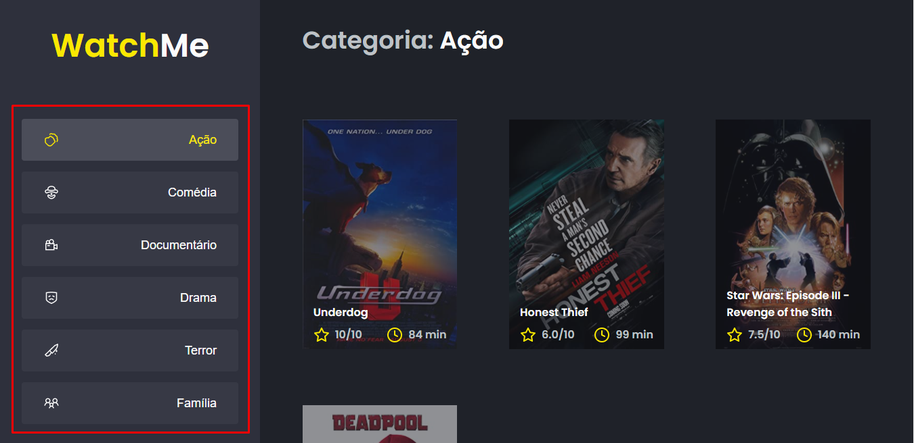

# WatchMe

<h1 align="center">
    
</h1>

[](./LEIAME.md)

## Summary

* [🧾 About](#-about)
* [🚀 Main technologies](#-main-technologies)
* [🔽 How to download the project](#-how-to-download-the-project)
* [💻 How to run the project](#-how-to-run-the-project)
* [👌 How to use the app](#-how-to-use-the-app)
<br>

## 🧾 About

A simple movie list app made with Javascript, Typescript e ReactJS 😃
<br>

## 🚀 Main technologies

* [React](https://reactjs.org/)
* [Typescript](https://www.typescriptlang.org/)
* [Webpack](https://webpack.js.org/)
* [Babel](https://babeljs.io/)
* [Sass](https://sass-lang.com/)

_(You can see all the dependencies in the [package.json](./package.json) file)_
<br>

## 🔽 How to download the project

```bash
$ git clone https://github.com/victorbadaro/ignite-watch-me-app
```
<br>

## 💻 How to run the project

The commands below use the [yarn](https://yarnpkg.com/) package manager.

```bash
# 1. Install all the project dependencies
$ yarn

# 2. Run JSON Server Fake API
yarn server

# 3. Run the app
$ yarn dev

# You can also generate the files to put the app into production with:
$ yarn build

# the files will be available in the dist/ folder
```

If everything runs correctly, a message will be displayed on your terminal informing that the app code has been successfully compiled:

```bash
Compiled successfully
```

After that open your browser and access: http://localhost:8080/

✅ Nice! If you followed all the steps above correctly the project will be running locally on your machine already.
<br>

## 👌 How to use the app

* Click on the side bar menus to see the movies organized by genre:
    

<br>

---
<p align="center">This project was created using this <a href="https://github.com/rocketseat-education/ignite-template-componentizando-a-aplicacao">template</a> and developed with ❤ by <a href="https://github.com/victorbadaro">Victor Badaró</a></p>